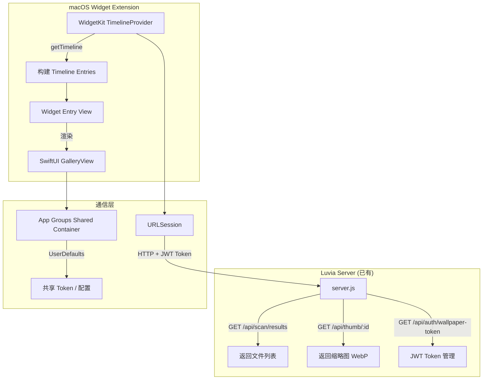
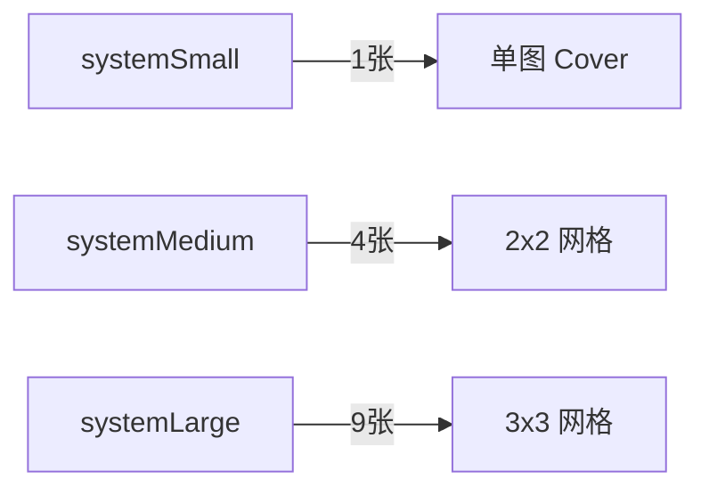

# macOS 桌面小组件实施方案

> **项目**: Luvia Gallery | **版本**: v1.0 | **日期**: 2026-03-30
> **范围**: macOS 原生桌面小组件 (WidgetKit + SwiftUI)
> **参考**: macOS 原生相册小组件

---

## 一、架构总览



### 核心思路

macOS 桌面小组件通过 **WidgetKit** 实现，与现有 Wallpaper Engine 组件共享相同的后端 API 通信模式：

1. **认证**: 复用 `/api/auth/wallpaper-token` 生成的 JWT Token（3650 天有效期）
2. **数据获取**: 复用 `/api/scan/results` 接口，参数 `random=true&limit=N`
3. **图片加载**: 复用 `/api/thumb/:id` 获取 WebP 缩略图
4. **配置共享**: 通过 **App Groups** 实现主应用与 Widget 间的 Token/配置共享

---

## 二、技术选型

| 维度 | 选型 | 理由 |
|------|------|------|
| 框架 | WidgetKit + SwiftUI | macOS 14+ 原生支持，内存/电量高效 |
| 语言 | Swift 5.9+ | WidgetKit 原生语言 |
| 网络请求 | URLSession | Widget 中无法使用第三方库，必须用系统 API |
| 图片缓存 | Widget URLCache + FileManager | 系统级缓存，Widget 生命周期友好 |
| 配置共享 | App Groups + UserDefaults(suiteName:) | 主应用与 Widget Extension 数据桥接 |
| 数据格式 | 与 Wallpaper Engine 一致 | 复用 `/api/scan/results` 返回格式 |

### macOS 原生相册小组件参考样式

macOS 相册小组件提供以下尺寸和布局：

| 尺寸 | systemSmall | systemMedium | systemLarge |
|------|-------------|--------------|-------------|
| 展示数量 | 1 张 | 2-4 张（网格） | 6-9 张（网格） |
| 布局 | 单图 cover | 2x2 或 1+3 网格 | 3x3 网格 |
| 圆角 | 系统默认 | 系统默认 | 系统默认 |

---

## 三、分阶段实施计划

### Phase 0: 前置准备（0.5 天）

#### 0.1 项目结构搭建

在项目根目录创建 `macos-widget/` 子目录：

```
macos-widget/
├── LuviaGalleryWidget/           # Widget Extension Target
│   ├── LuviaGalleryWidget.swift  # Widget 入口
│   ├── TimelineProvider.swift    # Timeline 数据提供者
│   ├── GalleryEntry.swift        # Timeline Entry 数据模型
│   ├── Views/
│   │   ├── SmallWidgetView.swift    # 小尺寸单图
│   │   ├── MediumWidgetView.swift   # 中尺寸网格
│   │   └── LargeWidgetView.swift    # 大尺寸网格
│   ├── Services/
│   │   ├── APIClient.swift          # HTTP 通信层（复用 wallpaper 逻辑）
│   │   ├── ImageCache.swift         # 图片缓存管理
│   │   └── TokenStore.swift         # Token 持久化（App Groups）
│   ├── Assets.xcassets/
│   └── Info.plist
├── LuviaGalleryWidget.xcodeproj   # Xcode 项目
└── Shared/                         # App Groups 共享代码
    └── Constants.swift              # App Group ID 等常量
```

#### 0.2 App Groups 配置

- 在 Apple Developer Portal 注册 App Group ID: `group.com.luvia.gallery`
- 配置主应用和 Widget Extension 共享该 Group
- 用于传递: JWT Token、Server URL、用户偏好配置

#### 0.3 后端 API 适配（无需改动）

现有 API 已完全满足 Widget 需求，无需修改后端：

| API | 用途 | 备注 |
|-----|------|------|
| `GET /api/scan/results?random=true&limit=N` | 获取随机图片列表 | 返回 `thumbnailUrl` 和 `url` |
| `GET /api/thumb/:id` | 获取 WebP 缩略图 | 带缓存头 `max-age=31536000` |
| `GET /api/auth/wallpaper-token` | 获取/生成 JWT Token | 已有 3650 天有效期 |

> **关键**: 现有 Wallpaper Engine 的 `wallpaper.js` 通过 `fetchItems()` 调用 `/api/scan/results?random=true&limit=100&token=JWT` 获取数据，Widget 将采用完全相同的通信模式。

---

### Phase 1: 核心通信层（1 天）

#### 1.1 TokenStore — Token 管理

```swift
// TokenStore.swift
// 通过 App Groups UserDefaults 在主应用与 Widget 间共享 Token

struct WidgetConfig: Codable {
    let serverUrl: String
    let token: String
    let mode: String  // "random" | "favorites" | "folder"
    let folderPath: String
    let showVideos: Bool
}

final class TokenStore {
    static let suiteName = "group.com.luvia.gallery"
    static let configKey = "widget_config"

    static func saveConfig(_ config: WidgetConfig) {
        guard let data = try? JSONEncoder().encode(config) else { return }
        UserDefaults(suiteName: suiteName)?.set(data, forKey: configKey)
    }

    static func loadConfig() -> WidgetConfig? {
        guard let data = UserDefaults(suiteName: suiteName)?.data(forKey: configKey),
              let config = try? JSONDecoder().decode(WidgetConfig.self, from: data)
        else { return nil }
        return config
    }
}
```

#### 1.2 APIClient — 网络请求（复用 Wallpaper 逻辑）

```swift
// APIClient.swift
// 对标 wallpaper.js 中的 fetchItems() 函数

struct MediaFile: Decodable {
    let id: String
    let url: String
    let thumbnailUrl: String
    let name: String
    let folderPath: String
    let mediaType: String
    let width: Int?
    let height: Int?
    let aspectRatio: Double?
}

struct ScanResult: Decodable {
    let files: [MediaFile]
    let total: Int
    let hasMore: Bool
}

actor APIClient {
    let serverUrl: String
    let token: String

    // 对标 wallpaper.js fetchItems()
    func fetchRandomFiles(limit: Int = 10, mode: String = "random", folder: String = "") async throws -> [MediaFile] {
        var components = URLComponents(string: "\(serverUrl)/api/scan/results")!
        var queryItems = [
            URLQueryItem(name: "random", value: "true"),
            URLQueryItem(name: "limit", value: "\(limit)"),
            URLQueryItem(name: "recursive", value: "true"),
            URLQueryItem(name: "token", value: token)
        ]

        if mode == "favorites" {
            queryItems.append(URLQueryItem(name: "favorites", value: "true"))
        } else if mode == "folder" && !folder.isEmpty {
            queryItems.append(URLQueryItem(name: "folder", value: folder))
        }

        components.queryItems = queryItems

        let (data, response) = try await URLSession.shared.data(from: components.url!)
        guard let httpResponse = response as? HTTPURLResponse,
              (200...299).contains(httpResponse.statusCode) else {
            throw WidgetError.networkError
        }

        let result = try JSONDecoder().decode(ScanResult.self, from: data)
        return result.files
    }

    // 对标 wallpaper.js getMediaUrl()
    func thumbnailURL(for fileId: String) -> URL {
        let base = "\(serverUrl)/api/thumb/\(fileId)"
        let encoded = base.addingPercentEncoding(withAllowedCharacters: .urlQueryAllowed)!
        return URL(string: "\(encoded)?token=\(token)")!
    }
}
```

#### 1.3 ImageCache — 图片缓存

```swift
// ImageCache.swift
// Widget 中必须使用本地文件缓存，不能依赖 URLSession 内存缓存

actor ImageCache {
    static let shared = ImageCache()
    private let cacheDir: URL
    private let fileManager = FileManager.default

    init() {
        let groupURL = FileManager.default.containerURL(
            forSecurityApplicationGroupIdentifier: "group.com.luvia.gallery"
        )!
        cacheDir = groupURL.appendingPathComponent("WidgetCache/Thumbnails", isDirectory: true)
        try? fileManager.createDirectory(at: cacheDir, withIntermediateDirectories: true)
    }

    func image(for fileId: String) async -> Data? {
        let fileURL = cacheDir.appendingPathComponent("\(fileId).webp")
        if fileManager.fileExists(atPath: fileURL.path) {
            return try? Data(contentsOf: fileURL)
        }
        return nil
    }

    func save(_ data: Data, for fileId: String) {
        let fileURL = cacheDir.appendingPathComponent("\(fileId).webp")
        try? data.write(to: fileURL)
    }
}
```

---

### Phase 2: Widget Timeline 实现（1 天）

#### 2.1 GalleryEntry — 数据模型

```swift
import WidgetKit

struct GalleryEntry: TimelineEntry {
    let date: Date
    let images: [MediaFile]       // 本地已缓存的图片信息
    let placeholderMode: Bool     // 是否为占位模式
    let serverReachable: Bool     // 服务器是否可达
}
```

#### 2.2 TimelineProvider — 数据驱动

```swift
import WidgetKit

struct GalleryProvider: TimelineProvider {
    func placeholder(in context: Context) -> GalleryEntry {
        GalleryEntry(date: Date(), images: [], placeholderMode: true, serverReachable: true)
    }

    func getSnapshot(in context: Context, completion: @escaping (GalleryEntry) -> Void) {
        // 快照模式：立即返回当前缓存
        completion(GalleryEntry(date: Date(), images: [], placeholderMode: true, serverReachable: true))
    }

    func getTimeline(in context: Context, completion: @escaping (Timeline<GalleryEntry>) -> Timeline) {
        Task {
            guard let config = TokenStore.loadConfig() else {
                // 未配置：显示引导 Entry
                let entry = GalleryEntry(date: Date(), images: [], placeholderMode: true, serverReachable: false)
                completion(Timeline(entries: [entry], policy: .after(Date().addingTimeInterval(3600))))
                return
            }

            let client = APIClient(serverUrl: config.serverUrl, token: config.token)

            do {
                let files = try await client.fetchRandomFiles(limit: 10, mode: config.mode, folder: config.folderPath)

                // 预缓存缩略图
                let imageCache = ImageCache.shared
                for file in files where file.mediaType == "image" {
                    if let data = try? await downloadThumbnail(client: client, fileId: file.id) {
                        await imageCache.save(data, for: file.id)
                    }
                }

                let entry = GalleryEntry(date: Date(), images: files, placeholderMode: false, serverReachable: true)
                // 每 30 分钟刷新一次（与 Wallpaper Engine 默认 freq=30s 对齐，但 Widget 需要更保守）
                let nextUpdate = Calendar.current.date(byAdding: .minute, value: 30, to: Date())!
                completion(Timeline(entries: [entry], policy: .after(nextUpdate)))
            } catch {
                // 网络错误：5 分钟后重试
                let entry = GalleryEntry(date: Date(), images: [], placeholderMode: true, serverReachable: false)
                completion(Timeline(entries: [entry], policy: .after(Date().addingTimeInterval(300))))
            }
        }
    }

    private func downloadThumbnail(client: APIClient, fileId: String) async throws -> Data {
        let url = client.thumbnailURL(for: fileId)
        let (data, _) = try await URLSession.shared.data(from: url)
        return data
    }
}
```

---

### Phase 3: UI 视图实现（1.5 天）

#### 3.1 尺寸适配策略



#### 3.2 小尺寸 Widget (systemSmall) — 单图展示

参考 macOS 相册小组件小尺寸：单张图片，圆角裁剪，底部可选文件名。

```swift
struct SmallWidgetView: View {
    let entry: GalleryEntry
    @Environment(\.widgetFamily) var family

    var body: some View {
        if entry.placeholderMode {
            placeholderView
        } else if let image = entry.images.first {
            singleImageView(image)
        }
    }

    private func singleImageView(_ file: MediaFile) -> some View {
        ZStack {
            if let cachedData = try? Data(contentsOf: localThumbURL(file.id)),
               let nsImage = NSImage(data: cachedData) {
                Image(nsImage: nsImage)
                    .resizable()
                    .aspectRatio(contentMode: .fill)
            } else {
                Color(.systemGray6)
            }

            // 底部渐变 + 文件名（参考 macOS 相册样式）
            VStack {
                Spacer()
                LinearGradient(
                    colors: [.clear, .black.opacity(0.4)],
                    startPoint: .top,
                    endPoint: .bottom
                )
                .frame(height: 40)

                Text(file.name)
                    .font(.caption2)
                    .foregroundColor(.white)
                    .lineLimit(1)
                    .padding(.horizontal, 8)
                    .padding(.bottom, 6)
            }
        }
        .clipShape(RoundedRectangle(cornerRadius: 16))
    }
}
```

#### 3.3 中尺寸 Widget (systemMedium) — 2x2 网格

参考 macOS 相册中尺寸：4 张图片均匀网格排列，间距 4pt。

```swift
struct MediumWidgetView: View {
    let entry: GalleryEntry

    var body: some View {
        if entry.placeholderMode {
            placeholderView
        } else {
            LazyVGrid(columns: [GridItem(.flexible(), spacing: 4), GridItem(.flexible(), spacing: 4)],
                      spacing: 4) {
                ForEach(entry.images.prefix(4), id: \.id) { file in
                    ThumbnailCell(file: file)
                }
            }
            .padding(4)
        }
    }
}
```

#### 3.4 大尺寸 Widget (systemLarge) — 3x3 网格

```swift
struct LargeWidgetView: View {
    let entry: GalleryEntry

    var body: some View {
        if entry.placeholderMode {
            placeholderView
        } else {
            LazyVGrid(columns: Array(repeating: GridItem(.flexible(), spacing: 4), count: 3),
                      spacing: 4) {
                ForEach(entry.images.prefix(9), id: \.id) { file in
                    ThumbnailCell(file: file)
                }
            }
            .padding(4)
        }
    }
}
```

#### 3.5 通用占位视图（未配置/加载中）

```swift
struct PlaceholderView: View {
    var body: some View {
        ZStack {
            Color(.systemGray6)
            VStack(spacing: 8) {
                Image(systemName: "photo.on.rectangle.angled")
                    .font(.title2)
                    .foregroundStyle(.secondary)
                Text("Luvia Gallery")
                    .font(.caption)
                    .foregroundStyle(.tertiary)
            }
        }
    }
}
```

---

### Phase 4: 配置界面 (WidgetConfiguration)（0.5 天）

macOS 14+ 支持 `AppIntents` 进行 Widget 配置，用户可在添加 Widget 时选择：

1. **数据模式**: 随机 / 收藏 / 指定文件夹
2. **刷新间隔**: 15 分钟 / 30 分钟 / 1 小时
3. **是否显示视频**: 开/关

```swift
struct GalleryWidgetConfiguration: WidgetConfigurationIntent {
    static var title: LocalizedStringResource = "Widget Settings"
    static var description: IntentDescription = "Configure your Luvia Gallery widget"

    @Parameter(title: "Mode", default: .random)
    var mode: DisplayMode

    @Parameter(title: "Refresh Interval", default: .thirtyMinutes)
    var refreshInterval: RefreshInterval

    @Parameter(title: "Show Videos", default: false)
    var showVideos: Bool

    enum DisplayMode: String, AppEnum {
        case random
        case favorites
        case folder
        static var typeDisplayRepresentation: TypeDisplayRepresentation {
            "Display Mode"
        }
        static var caseDisplayRepresentations: [DisplayMode: DisplayRepresentation] {
            [
                .random: "Random",
                .favorites: "Favorites",
                .folder: "Specific Folder"
            ]
        }
    }

    enum RefreshInterval: String, AppEnum {
        case fifteenMinutes = "15"
        case thirtyMinutes = "30"
        case oneHour = "60"
        static var typeDisplayRepresentation: TypeDisplayRepresentation {
            "Refresh Interval"
        }
    }
}
```

---

### Phase 5: 联调与优化（1 天）

#### 5.1 Token 初始配置流程

```
用户在 Web 端设置面板生成 Wallpaper Token
    ↓
Web 端展示 QR 码 / URL Scheme（含 serverUrl + token）
    ↓
用户在 macOS 打开链接 → 主 App 写入 App Groups
    ↓
Widget 自动读取配置并开始展示
```

**备选方案**: 在 Web 设置面板新增一个"Widget 配置"区域，生成一个 `luviagallery://widget-config?server=...&token=...` URL Scheme，macOS 用户点击后自动完成配置。

#### 5.2 性能优化清单

| 优化项 | 方案 |
|--------|------|
| 内存限制 | Widget 最多加载 9 张缩略图，使用 WebP 格式（已有） |
| 网络开销 | 仅获取 `thumbnailUrl`（WebP ~50KB），不获取原图 |
| 刷新策略 | Timeline 策略 `.after(30min)`，避免频繁刷新被系统限制 |
| 离线兜底 | 使用 App Groups 缓存最后一批图片，离线时展示缓存 |
| 启动速度 | Timeline 预加载，Widget 展示时直接读本地缓存 |
| Widget 内存上限 | systemSmall: 30MB / systemMedium: 30MB / systemLarge: 30MB |

#### 5.3 通信方式对比（Wallpaper vs Widget）

| 维度 | Wallpaper Engine (现有) | macOS Widget (新增) |
|------|------------------------|-------------------|
| 运行环境 | CEF Browser | WidgetKit (Swift) |
| 认证方式 | URL 参数 `?token=JWT` | HTTP Header `Authorization: Bearer` |
| API 接口 | `/api/scan/results` | `/api/scan/results`（相同） |
| 数据格式 | JSON → JS Object | JSON → Swift Codable |
| 图片加载 | `` | URLSession → 本地文件 |
| 配置传递 | WE Properties / localStorage | App Groups UserDefaults |
| 刷新机制 | `setInterval(CONFIG.interval)` | WidgetKit Timeline |
| 离线回退 | Demo Mode（内置素材） | 本地缓存兜底 |

---

## 四、关键风险与应对

| 风险 | 影响 | 应对策略 |
|------|------|----------|
| Widget 内存限制 (30MB) | 大图可能导致 Widget 被系统杀死 | 仅使用缩略图 (WebP)，限制加载数量 ≤9 张 |
| 后台刷新受限 | iOS/macOS 可能延迟 Timeline 刷新 | 使用 `.after()` 策略，不依赖 `.atEnd()` |
| Token 过期 | 10 年有效期 Token 过期后 Widget 停止更新 | Web 端检测 Token 即将过期时推送通知 |
| 服务器不可达 | Widget 显示空白 | 离线模式展示缓存图片 + 占位 UI |
| 网络延迟 | 首次加载慢 | Timeline 预取 + 本地缓存优先策略 |
| App Groups 权限 | 需 Apple Developer 付费账号 | 项目已有开发者账号 |

---

## 五、文件变更清单

### 新增文件

```
macos-widget/                                    # 全新目录
├── LuviaGalleryWidget/
│   ├── LuviaGalleryWidget.swift                 # Widget 入口定义
│   ├── GalleryProvider.swift                    # TimelineProvider
│   ├── GalleryEntry.swift                       # Timeline Entry 模型
│   ├── GalleryWidgetConfiguration.swift         # AppIntents 配置
│   ├── Services/
│   │   ├── APIClient.swift                      # HTTP 通信（对标 wallpaper.js）
│   │   ├── ImageCache.swift                     # 图片缓存
│   │   └── TokenStore.swift                     # Token 管理
│   └── Views/
│       ├── SmallWidgetView.swift                # 小尺寸
│       ├── MediumWidgetView.swift               # 中尺寸
│       ├── LargeWidgetView.swift                # 大尺寸
│       ├── ThumbnailCell.swift                  # 通用缩略图单元
│       └── PlaceholderView.swift                # 占位/引导视图
├── LuviaGalleryWidget.xcodeproj/
└── Shared/
    └── Constants.swift                          # App Group ID 常量
```

### 后端变更

**无**。现有 API 完全满足需求：
- `/api/scan/results` — 返回随机图片列表（含 `thumbnailUrl`）
- `/api/thumb/:id` — 返回 WebP 缩略图
- `/api/auth/wallpaper-token` — JWT Token 管理

### Web 端可选变更

在 `SettingsModal.tsx` 的 Wallpaper Token 区域新增：
- 一键生成 Widget 配置 URL Scheme 的按钮
- QR 码展示（方便移动端扫码配置）

---

## 六、Timeline 验收流程

```
Phase 0 [0.5天]
  ├── 搭建 Xcode 项目结构
  ├── 配置 App Groups
  └── 验证后端 API 兼容性 ✓（已确认无需改动）

Phase 1 [1天]
  ├── TokenStore 实现 + 测试
  ├── APIClient 实现 + 测试（对比 wallpaper.js 输出）
  └── ImageCache 实现 + 测试

Phase 2 [1天]
  ├── TimelineProvider 实现
  ├── Timeline 策略调优
  └── 离线回退测试

Phase 3 [1.5天]
  ├── SmallWidgetView（单图）
  ├── MediumWidgetView（2x2 网格）
  ├── LargeWidgetView（3x3 网格）
  ├── PlaceholderView（引导）
  └── 视觉调优（对比 macOS 相册小组件）

Phase 4 [0.5天]
  ├── AppIntents 配置界面
  └── 配置持久化

Phase 5 [1天]
  ├── Token 配置流程联调
  ├── 性能/内存压力测试
  ├── 离线/网络切换测试
  └── 深度审计
```

---

## 七、总工期估算

| 阶段 | 工期 | 累计 |
|------|------|------|
| Phase 0: 前置准备 | 0.5 天 | 0.5 天 |
| Phase 1: 核心通信层 | 1 天 | 1.5 天 |
| Phase 2: Timeline 实现 | 1 天 | 2.5 天 |
| Phase 3: UI 视图 | 1.5 天 | 4 天 |
| Phase 4: 配置界面 | 0.5 天 | 4.5 天 |
| Phase 5: 联调优化 | 1 天 | 5.5 天 |
| **合计** | **5.5 天** | |
